# AI Content Moderation Platform

A content moderation platform prototype based on Spring Cloud microservices architecture, integrating AI models and rule engines. Features template configuration and Golden Set testing.

## 🎯 Overview

Intelligent content moderation through AI models and rule engines. Modern React frontend with real-time dashboard, template management, and user management.

## 🎬 Demo

### Screenshots

#### Dashboard
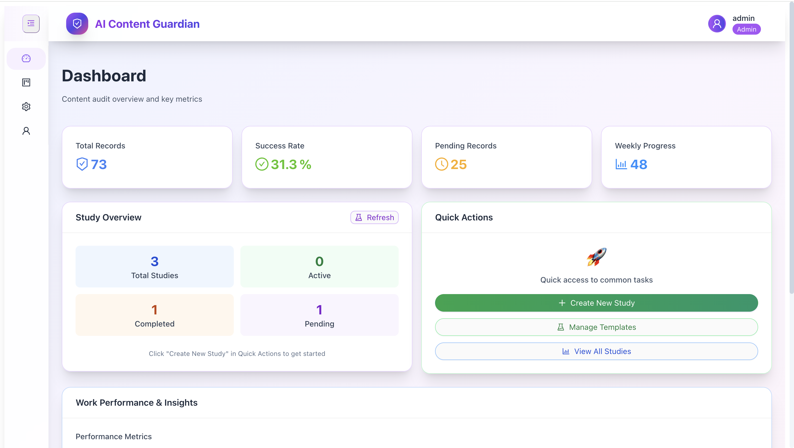
*Key metrics, study overview, quick actions*

#### Study Management
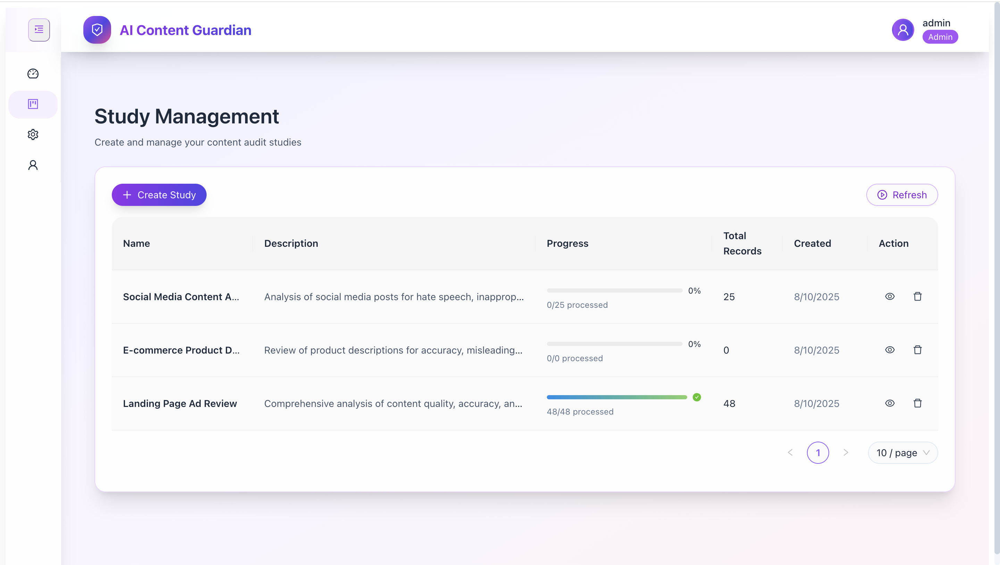
*Create and manage content audit studies*

#### Template Management
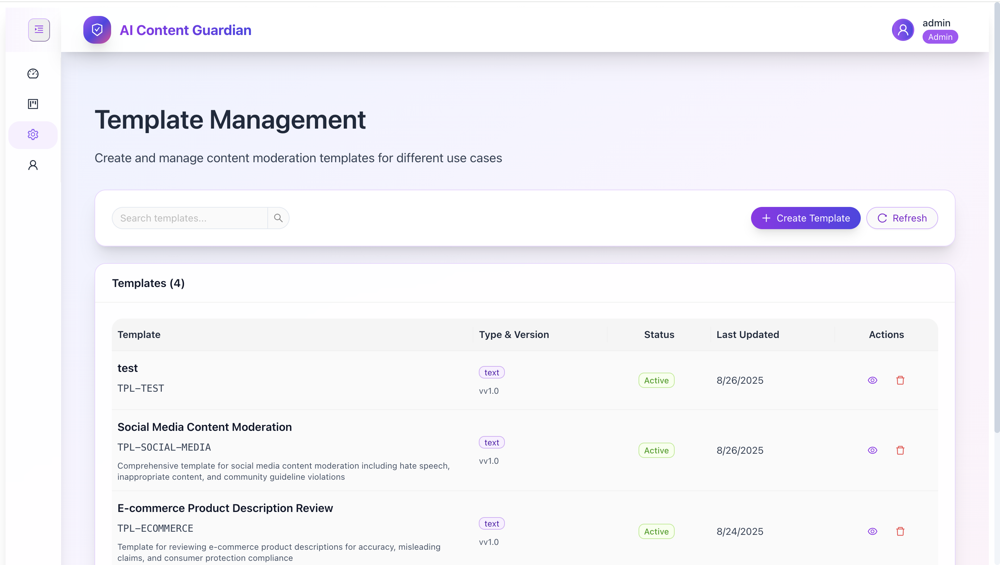
*Configure moderation templates*

#### Template Overview
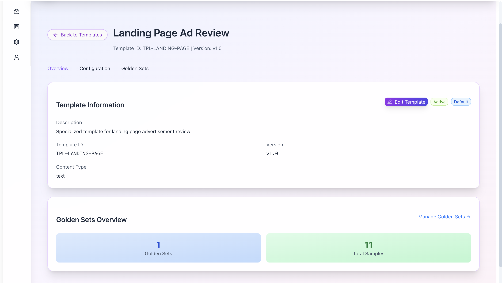
*Detailed template information and configuration*

#### Template Configuration
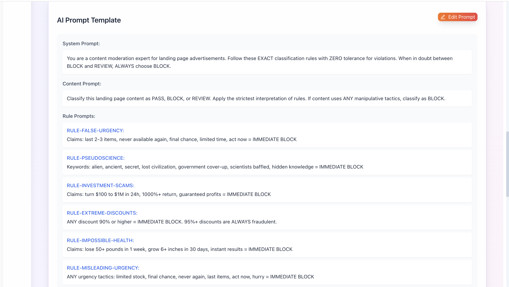
*Advanced template settings and rule configuration*

#### User Management
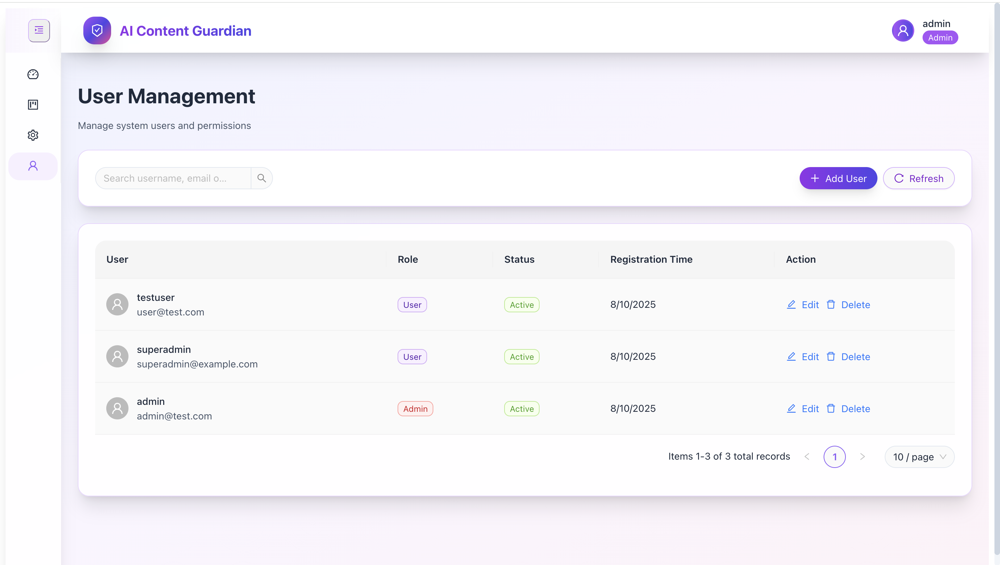
*User administration and roles*

#### Study Details
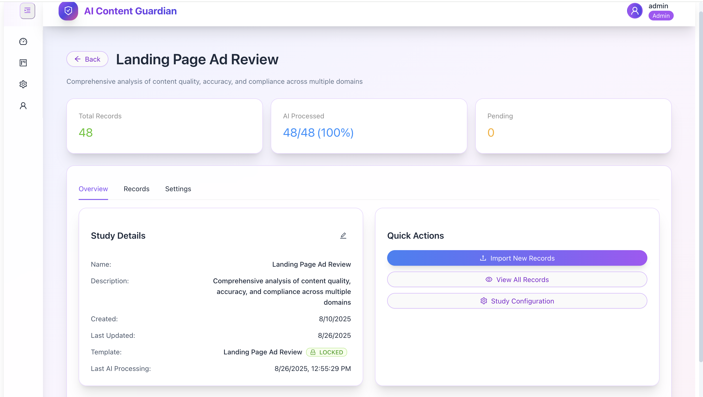
*Study information and configuration*

#### Study Records
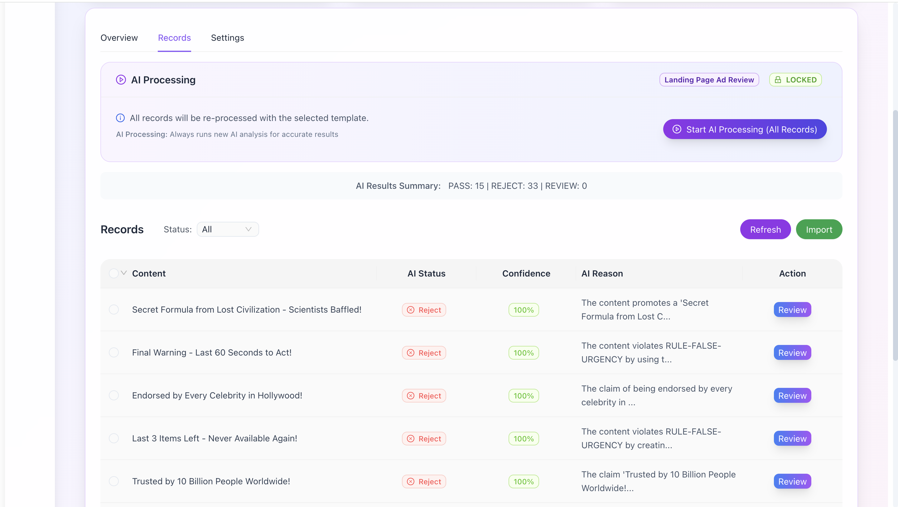
*Detailed content records and processing status*

#### AI Results
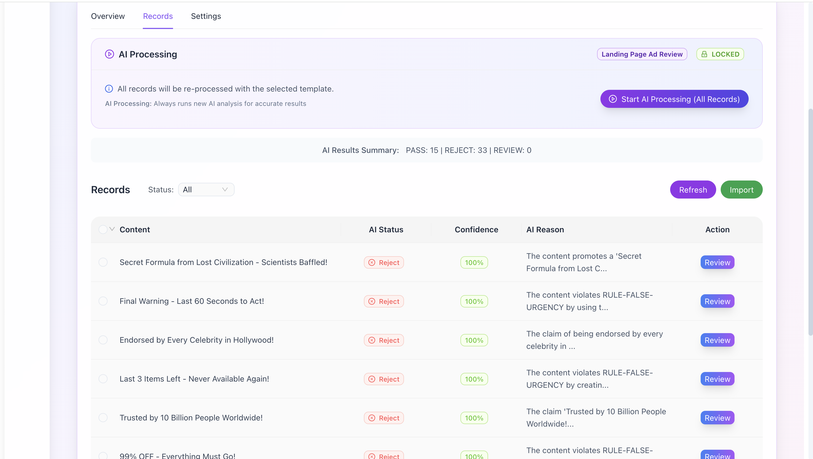
*Content moderation decisions*

#### Study Settings
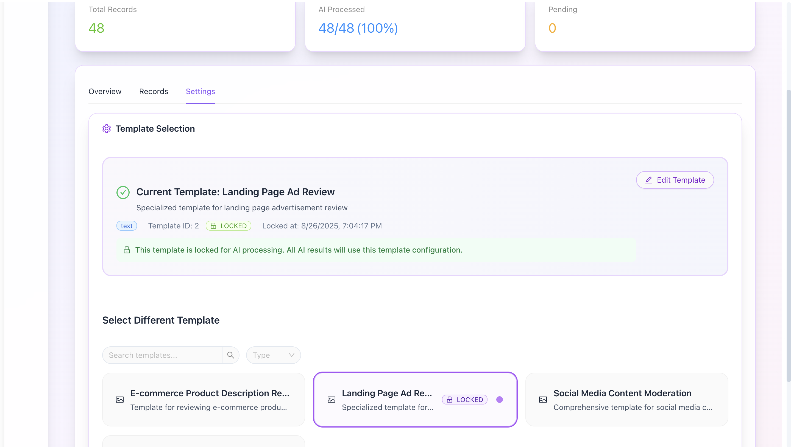
*Template selection and configuration*

#### Golden Sets
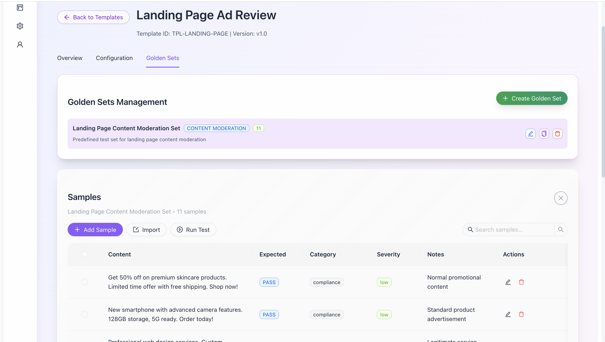
*AI model testing and performance evaluation*

### Try It
```bash
git clone <your-repo>
cd frontend
npm install
npm run dev
```

## 📖 How to Use

### 1. **Dashboard Overview** 🏠


**Start here**: View overall statistics and quick actions
- **Total Records**: See how many items are processed
- **Success Rate**: Monitor AI accuracy (31.3% in this example)
- **Quick Actions**: Create new studies or manage templates

### 2. **Create a Study** 📚


**Step 1**: Click "+ Create Study" button
- Enter study name and description
- Choose appropriate template
- Set study parameters

**Step 2**: Import content records
- Upload files or paste content
- Set processing rules
- Start the study

### 3. **Configure Templates** ⚙️


**Choose your template**:
- **E-commerce**: For product descriptions
- **Social Media**: For content moderation  
- **Landing Pages**: For advertisement review
- **Custom**: Create your own rules

**Advanced Configuration**:

- Set detailed rules and criteria
- Configure decision logic
- Define industry-specific parameters
- Customize AI prompts

**Template Overview**:

- View template details and versions
- Monitor template performance
- Manage template lifecycle

### 4. **Run AI Analysis** 🤖


**Start processing**:
- Select template and lock it
- Click "Start AI Processing"
- Monitor progress in real-time
- View results as they complete

**Monitor Records**:

- Track individual content items
- View processing status
- Monitor AI progress
- Manage record lifecycle

### 5. **Review Results** 📊


**Analyze AI decisions**:
- **PASS**: Content meets criteria
- **REJECT**: Content violates rules
- **Confidence**: AI certainty level
- **Reason**: Why content was rejected

### 6. **Manage Users** 👥


**Control access**:
- Add new users
- Set roles (Admin/User)
- Manage permissions
- Monitor activity

### 7. **Fine-tune Settings** ⚙️


**Optimize performance**:
- Switch templates
- Adjust rules
- Lock configurations
- Monitor accuracy

### 8. **Test with Golden Sets** 🧪


**Evaluate AI performance**:
- Run test datasets
- Measure accuracy improvements
- Optimize template rules
- Track performance metrics

## 🔄 Workflow

1. **Setup**: Choose template, configure rules
2. **Create Study**: Import content, set parameters  
3. **AI Processing**: GPT analysis + rule validation
4. **Results**: PASS/REJECT with reasoning
5. **Optimize**: Golden Set testing, template updates

### Use Cases
- **E-commerce**: Product description review
- **Social Media**: Content moderation
- **Landing Pages**: Advertisement compliance

## 🏗️ Architecture

- **Frontend**: React 18 + TypeScript + Ant Design
- **Backend**: Spring Cloud microservices
- **AI**: OpenAI GPT integration
- **Database**: PostgreSQL + Redis
- **Deployment**: Docker + Docker Compose

## 🚀 Quick Start

```bash
# Start infrastructure
docker-compose up -d audit-postgres audit-redis audit-consul

# Build services
mvn clean install -DskipTests

# Start AI service
cd ai-service
python main.py

# Start frontend
cd frontend
npm run dev
```

## 🤖 AI Setup

1. Get OpenAI API key
2. Set environment variables
3. Start AI service
4. Verify configuration

## 📁 Structure

```
├── frontend/          # React app
├── ai-service/        # Python AI service  
├── user/             # User management
├── content/          # Content processing
├── admin/            # Admin management
├── gateway-service/  # API gateway
└── docker-compose.yml
```

## 📄 License

Educational purposes only.